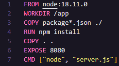

# Aula 01 - Docker

Containers isolam a aplicação do resto da maquina, configurações de projetos e serviços externos não afetaram projetos mesmo estando na mesma máquina, ex: ter dois microsserviços com versões diferentes do node rodando na mesma máquina.

## Comandos

```docker
    docker container ls  # Lista todos os containers
        -a  # Lista os containers com status exited também

    docker image ls  # Lista todas as imagens

    docker container run `IMAGEM` # Roda um container da imagem passada no comando
        --name `NOME` # Define um nome para o container
        --rm # Quando o container termina de ser executado é excluído automaticamente
        -it # -it entra em modo interativo habilitando tty
        -d # Para o container rodar em background
        -p `PORTA_MAQUINA`:`PORTA_CONTAINER` # Port binding - vincular a parta do container com a porta da máquina
        -e `NOME`=`VALOR` # Passar variável de ambiente

    docker container rm `ID_DO_CONTAINER` # Exclui um container
        -f # Força a excluir um container

    docker container stop `ID_DO_CONTAINER` # Para' um container

    docker build -t ubunto-curl . # Constrói uma imagem
        -t `NOME` # Define o nome da imagem
        . # Qual diretório qu vai ser enviado para criar a imagem (como o Dockerfile está na raiz do projeto passo ".") 
        -f `./Dockerfile` # Define caminho do arquivo Dockerfile (por padrão ele já vai no diretório atual)

    docker image prune # Exclui imagens que não tem referencia
    docker image rm `ID_DA_IMAGEM` # Exclui uma imagem

    docker tag # Cria uma nova imagem com outro nome usando a antiga como base

    # docker -it ubunto /bin/bash rodar um ubunto interativo no container     
```

## Dockerfile
### Comandos

```docker
    FROM # Incia o build de uma imagem a partir de uma outra imagem base
    WORKDIR # Cria e entra em um diretório (tipo mkdir e cd)
    RUN # Executa um comando
    LABEL # Adiciona metadados a imagem
    EXPOSE # Define que o container precisa expor uma porta
    ENV # Variável de ambiente
    COPY # Copia arquivos ou diretórios e adiciona ao sistema de arquivos da imagem
    ADD # Copia arquivos ou diretórios e adiciona ao sistema de arquivos da imagem (optar pelo COPY)
    CMD # Define o comando e/ou os parâmetros padrão
    ARG # Define um argumento para ser usando no processo de construção
    ENTRYPOINT # Ajuda a configurar um container que pode ser executado com um executável
    VOLUME # Define volumes que devem ser definidos 
```

### Arquivo



    Linha 1 => Definindo imagem e versão base  
    Linha 2 => Criando e entrando na pasta app
    Linha 3 => Copiando todos os arquivos package*.json para o container
    Linha 4 => Rodando npm install para instalar as dependências
    Linha 5 => Copiando todo os outros arquivos
    Linha 6 => Definindo que a parta 8080 vai ser exposta
    Linha 7 => Rodando o comando "node server.js" para inciar a aplicação

No FROM não precisaria ser definida a versão da imagem, porém ela seria sempre a mais nova e isso poderia gerar erros de incompatibilidade caso fosse lançada uma nova versão da imagem e o código não estivesse ajustado para ela.
<br/><br/>
No  primero COPY é feito package*.json para copiar todos arquivos que comecem com package e seja um json. No nosso caso são o package.json e package-lock.json.
<br/><br/>
É feito um COPY do package.json e npm install antes de copiar os outros arquivos para que o npm install só rode novamente caso seja feito alguma alteração no package.json. Caso contrario qualquer alteração feita em qualquer arquivo rodaria o npm install novamente ao fazer um novo build da imagem.


